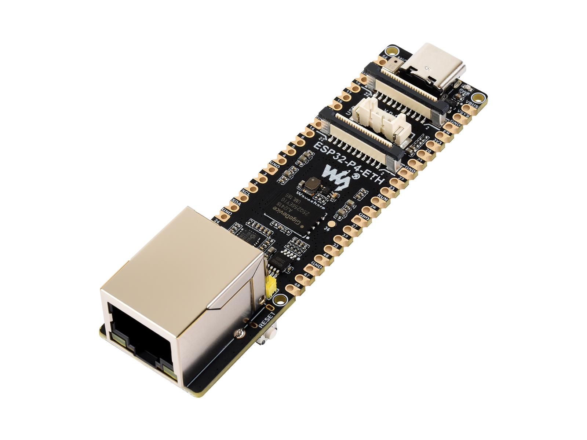
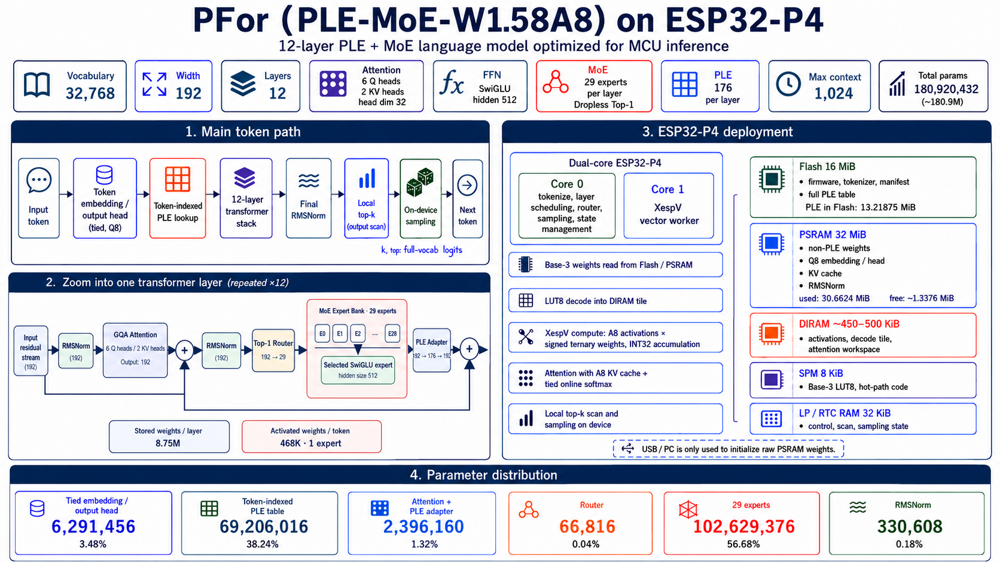

# PFor（nink fork）

[English documentation](README.md)

本仓库是 [cyfrit/p-for-llm](https://github.com/cyfrit/p-for-llm) 的 fork：[nink/p-for-llm](https://github.com/nink/p-for-llm)。

**本 fork 的硬件、主机协议和训练机与上游不同。** 不要按 WT9932P4-Tiny / USB-Serial-JTAG / RTX 5060 Ti 来用。

## 硬件



| | |
| --- | --- |
| 板卡 | [Waveshare ESP32-P4-ETH](https://www.waveshare.com/wiki/ESP32-P4-ETH) |
| SoC | ESP32-P4 **v1.3**（本固件 360 MHz） |
| 内存 | **32 MB** PSRAM · **16 MB** Flash |
| 以太网 | 10/100 · 主机协议 **TCP 8742** |
| Type-C | **CH343 UART**（烧录 + 备用主机口），不是乐鑫 USB-Serial-JTAG |
| 存储 | microSD `pfor-psram.bin` |

行星命名见 `runtime/host/boards.json`：**Sun**（协调器，以太网）、**Mercury**（专家卡，当前 UART）。下一步是 **6 块 P4-ETH + 8 口千兆交换机**。

```powershell
python runtime/host/chat.py --board sun
```

请用 **本 fork 编译的固件**（UART + 以太网 + SD + 压缩）。上游 Release 里的 zip 不含这些改动。权重文件仍可从[上游 Release](https://github.com/cyfrit/p-for-llm/releases/latest) 取 `pfor-180m.llmcraft`。SD 用法见 [docs/SD-PAYLOAD.md](docs/SD-PAYLOAD.md)。

## 模型（单芯片）



图是单芯片 PLE-MoE（结构未改）。本 fork 从 **microSD / 以太网** 加载 PSRAM，不再走 USB-Serial-JTAG。约 **8 tok/s**，原生上下文 **1024**，压缩后有效约 8k。详见英文 README。

## 训练（本 fork）

上游约 12B token、**RTX 5060 Ti**。本 fork 在 Linux **`192.168.72.70`** 上用 **NVIDIA CMP 170HX 64 GB** 训练（FineWeb-Edu 等）。同机两张 3090 当前未被 CMP 解锁驱动识别。脚本：`training/scripts/run-main-fineweb.sh`。

双卡下一步：**58 专家、top-2**，以太网 RPC。见 `training/configs/p4-dual.json`。

## 许可证

见 [LICENSE](LICENSE)。
