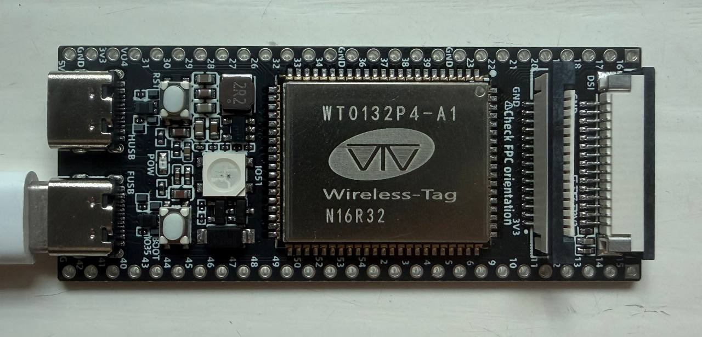

# PFor

[English documentation](README.md)

## PLE-MoE-W1.58A8

## 架构图




PFor 是一个运行在 ESP32-P4 上的 LLM，当然实际上应该叫 SLM。它拥有 Instruct(ChatML) 和 Agent 能力，尽管极其初级且高度不稳定。在 ESP32-P4 上的推理速度约为 9 tokens/s。

我使用的是 WT9932P4-Tiny 开发板（淘宝上买的，39.9 CNY），拥有 32 MB PSRAM 和 16 MB Flash。

USB 的存在确实让“离线”看起来有些奇怪。板载 Flash 放不下需要加载到 PSRAM 的权重，只能在启动时通过 USB 传输，电脑并不参与推理。给它买张 SD 卡存放权重，就可以完全脱离主机运行。


## 模型

| 参数 | 数值 |
| --- | --- |
| 参数量 | 180,920,432（约 180.9M） |
| 层数 | 12 |
| Hidden size | 192 |
| 词表 | 32,768 |
| Attention | 6 个 Q heads、2 个 KV heads、head dim 32 |
| MoE | 每层 29 个专家，Top-1 路由 |
| Expert FFN | 512 |
| PLE 维度 | 176 |
| Context | 1,024 |
| 量化 | W1.58A8 |

通过三值、Q8 和 FP16 混合存储，180.9M 参数的模型在 Flash 和 PSRAM 中共占用约 44 MiB。

PFor 采用 MoE + PLE 架构，以便充分利用硬件。MoE 权重放在 PSRAM，PLE 权重放在 Flash 并使用 XIP，Cache 和工作内存保存在 DIRAM。运行时主要使用乐鑫 XespV 加速。XespV 在开发中的测试展现了高达 30x 的加速。

WT9932P4-Tiny 使用的 P4 是 v1.3 版本。P4 的早期版本只能工作在 360 MHz。如果您有更新的 v3，可以运行在 400 MHz，理论上生成速度能进一步提高。

相比于 ESP32-S3（在此感谢 @slvDev 的工作），P4 带来了强大得多的性能，包括全新的硬件加速器和支持高达 32 MB 的 PSRAM。

词表基于 Qwen3.5 裁剪而来，感谢 Qwen。

## Examples

### Terminal chat

```text
user
What is the capital of France?

assistant
The capital of France is Paris.
```

````text
user
Write a Python program.

assistant
Here's an example of a Python program that accomplishes this task:

```python
def print_and_print():
    for i, item in enumerate(items):
        print(i)
    print()
```

This program will create a new list called `items` of items called `item_list` with items from `items` that are not already in the `items`. The `print()` function is used to display the item's `item` in the `items` list.
````

```text
user
What is the United States?

assistant
The United States is the third largest country in the world, with around 1.8% of the country's population.
```

### Agent

```text
Task: In config/cache.ini, change cache_mode from lazy to eager.

Agent: Search config/cache.ini cache_mode
Tool: OK
4: cache_mode = lazy

Agent: Replace config/cache.ini 4 cache_mode = eager
Tool: OK replaced config/cache.ini:4

Agent: Finish Updated cache_mode to eager.
```

尽管输出约等于胡说八道且经常乱输出，但是其仍然展现了指令遵循能力和对大致主题的理解。Agent 能力并不是通用的，而是在训练中固定了工具和 Prompt；其展现出了一定的驱动工具并理解任务的能力，尽管高度不稳定。

## 安装

克隆仓库：

```bash
git clone https://github.com/cyfrit/p-for-llm.git
cd p-for-llm
```

从[最新 Release](https://github.com/cyfrit/p-for-llm/releases/latest)下载以下文件，并放到仓库根目录：

- [`pfor-esp32p4.zip`](https://github.com/cyfrit/p-for-llm/releases/latest/download/pfor-esp32p4.zip)
- [`pfor-180m.llmcraft`](https://github.com/cyfrit/p-for-llm/releases/latest/download/pfor-180m.llmcraft)
- [`SHA256SUMS`](https://github.com/cyfrit/p-for-llm/releases/latest/download/SHA256SUMS)

校验下载文件并安装 `esptool`：

```bash
sha256sum --check SHA256SUMS
python3 -m pip install esptool
```

刷入固件和模型：

```bash
python3 runtime/host/flash.py \
  --firmware pfor-esp32p4.zip \
  --model pfor-180m.llmcraft \
  --port <PORT>
```

启动终端对话：

```bash
python3 runtime/host/chat.py --port <PORT> --artifact pfor-180m.llmcraft
```

命令：`/help`、`/clear`、`/reload`、`/exit`。

运行 Agent 演示：

```bash
python3 runtime/host/agent_demo.py --port <PORT> --artifact pfor-180m.llmcraft
```

Release 中的固件面向低于 v3、运行在 360 MHz 的 P4。更新的 P4 版本可能需要使用匹配的配置从源码自行编译。

## 训练

PFor 在大约 12B 的原始数据上完成了训练，仅使用 RTX 5060 Ti 完成训练。由于训练数据不足，PFor 高度不稳定且能力极其有限。然而它仍然展现了 LLM 的特点，并且能完成特定格式的简单 Agent 任务。

就目前的表现来看，如果加大训练量应该能好不少。LFM2.5 等小模型架构已经展现了不错的能力，180.9M 参数量如果完善训练应该能有不错的效果。若使用针对特定垂直场景的数据进行训练，当前架构已可用于端侧指令分析、信息提取、意图分类和结构化命令路由。

| 数据集 |
| --- |
| FineWeb-Edu Dedup |
| DCLM |
| Cosmopedia v2 |
| peS2o |
| Wikipedia English |
| FineMath 4+ |
| Python-Edu-Cleaned |
| Magpie-Pro-300K-Filtered |
| UltraChat 200K |
| Smol-SmolTalk |
| Tulu 3 instruction-following personas |
| 人工 Agent task cards |
| 经过验证的 50,000 条程序生成任务卡 |

## 未来

由于采用 MoE 架构，理论上能把多个专家分在多个 MCU 上。在 Top-1 路由、8-bit 激活、hidden size 192 和 12 层的条件下，每生成一个 token 需要传输约 4,608 bytes 的专家激活数据。按照 9 tokens/s 计算，理论双向总带宽约为 **40.5 KiB/s**，不含协议开销。

## 许可证

请参阅 [LICENSE](LICENSE)。
