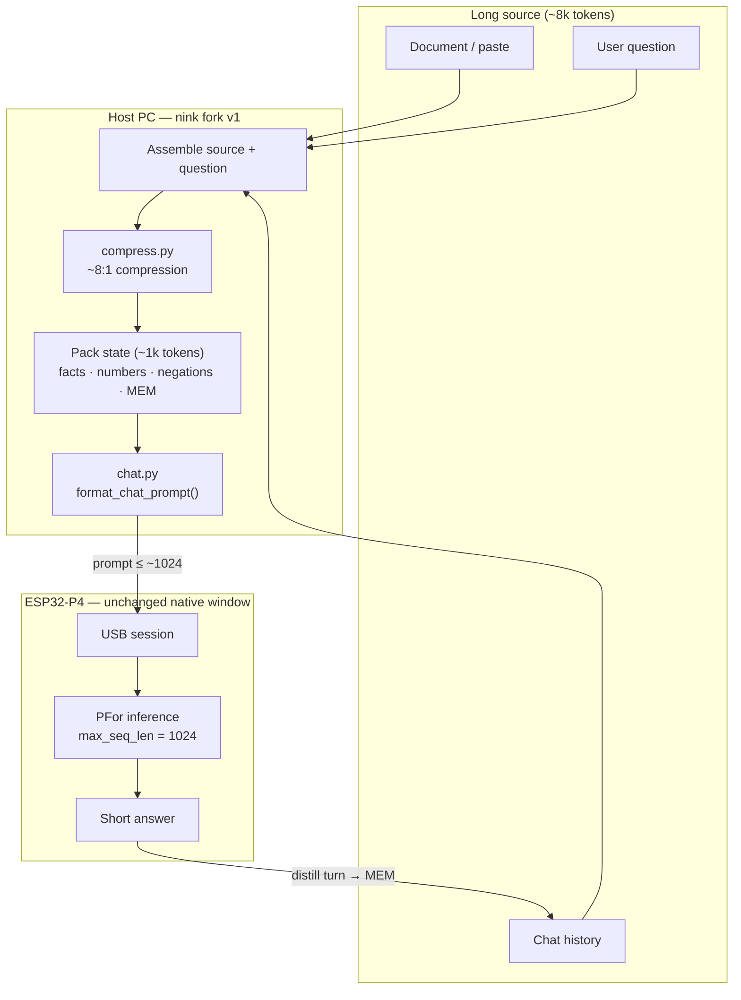
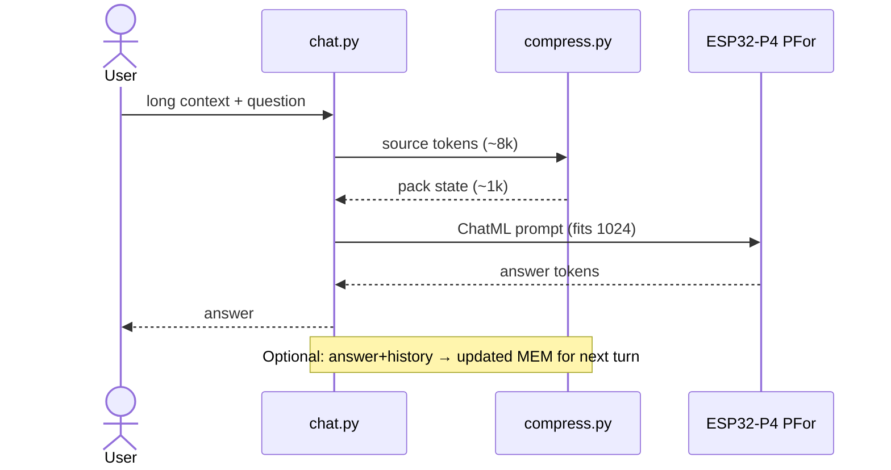

# Goal 1: Context compression (effective long context)

This document is the first product/engineering goal for the **nink/p-for-llm** fork.

Upstream PFor exposes a native context window of **1,024 tokens** (KV/RAM limited on ESP32-P4). We are **not** trying to raise native KV to 8K in this goal. We are raising **effective** context via compression.

## Approach: achieve, then optimize

Ship a **simple working path** first. Do not start with LLMLingua-class token classifiers, on-device distillers, or finetuning.

| Phase | Goal | Done when |
| --- | --- | --- |
| **0 — Bring-up** | Stock PFor chat on ESP32-P4 via this fork | `chat.py` answers short prompts on hardware |
| **1 — Achievable MVP** | Host-side **extractive / budget trim** to ~8:1 into the 1,024 window | Long paste + question works end-to-end; ratio logged |
| **2 — Optimize** | Better retention (query-aware keep, schema pack, optional LLMLingua-style / small compressor) | Higher eval score at same ~8:1 (or stable quality at higher ratio) |

**Phase 1 method (intentionally boring):** keep question + headings + sentences with numbers/names; drop filler until under budget. Good enough to prove effective long context.

**Phase 2+:** only after Phase 1 is measurable — smarter compression, rolling `MEM`, on-device compress, finetune on pack-state dialect.

## Target

| Metric | Goal |
| --- | --- |
| Compression ratio | **~8:1** (source tokens → tokens sent to the model) |
| Native window | Still **1,024** |
| Effective input | ~**8,000** tokens of source material per turn (before reply budget) |
| First implementation | **Host-side** (PC), wrapping the existing USB chat path |
| Later (optional) | On-device distill pass; finetune model on compressed “pack state” dialect |

Example: an ~8k-token document or chat history is reduced to ~1k tokens of dense state, then passed to `P4Device.text()` as today.

## Architecture

Effective long context = **compress outside the model**, then run normal PFor inference inside the native 1,024-token window.



### Trust boundary

| Stage | Where | Role |
| --- | --- | --- |
| Ingest long text | Host | Accept ~8k-token source |
| Compress 8:1 | Host `compress.py` | Lossy but structured packet |
| Generate | P4 PFor | Native 1,024 KV only |
| Roll memory | Host | `MEM` keeps multi-turn effective context |



### Compression sketch (pack state)

```text
SRC  ████████████████████████████████  ~8000 tokens
         │  8:1 compress
         ▼
PKT  ████                              ~1000 tokens  →  PFor (1024 window)
         + question + reply budget
```

## What success looks like

### Phase 1 (ship this)

1. User provides long text (~8k tokens) + a question on the host.
2. Fork trims/extracts to a packet that fits the native window with reply budget.
3. Board answers using only that packet + question.
4. Logs show compression ratio near **8:1** (exact quality secondary to “it works”).

### Phase 2 (optimize later)

- Query-aware retention (keep what the question needs)
- Structured pack state / rolling `MEM` for multi-turn
- Optional stronger compressors; measure quality on a fixed eval set

## Non-goals (for Phase 1)

- Expanding on-chip KV cache to true 8K context
- Domain apps (vehicle diagnostics, appliances, education packs)
- Replacing upstream training/runtime architecture
- Best-in-class compression research

## Planned code touchpoints

- `runtime/host/compress.py` — Phase 1: budgeted extractive compress API
- `runtime/host/chat.py` — optional `--compress` path before `device.text(...)`
- Simple ratio logging; eval fixtures when optimizing (Phase 2)

## Status

**In progress.**

- Phase 0: firmware + model flashed; board boots (`p_for_llm_esp32p4`). Chat protocol uses **USB Serial/JTAG** (Espressif `VID_303A`), not the CH343 console UART.
- Phase 1: host compressor landed in `runtime/host/compress.py` and `--compress` on `chat.py`.

### Windows ports (important)

| Port | Chip | Role |
| --- | --- | --- |
| CH343 / CH9102 COM | USB-UART bridge | Console log + `esptool` flash |
| USB Serial Device (Espressif `303A:1001`) | USB-Serial-JTAG | **`chat.py` / `smoke_test.py` host protocol** |

If chat times out with no `LLMRDY05`, plug the board USB that enumerates as Espressif JTAG/serial (often a second cable or the main USB-C once drivers bind).

### Phase 1 commands

```bash
# Offline compression check (no board)
python runtime/host/compress.py \
  --source runtime/host/testdata/sample_long_context.md \
  --question "Why do plant cells need chloroplasts?"

# On-device (Espressif USB Serial/JTAG port)
python runtime/host/chat.py --port COMx \
  --artifact pfor-180m.llmcraft \
  --compress \
  --context-file runtime/host/testdata/sample_long_context.md
```

