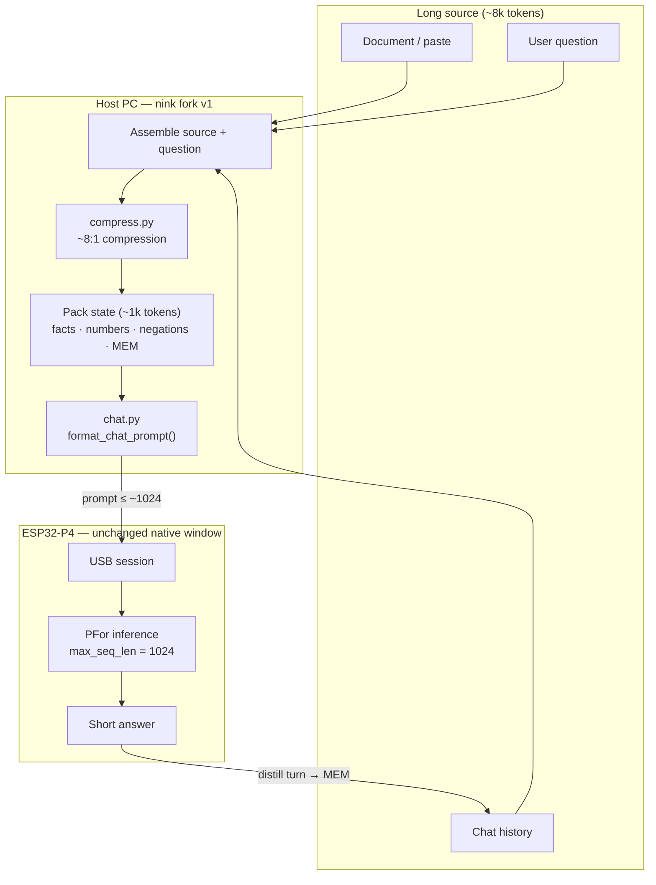
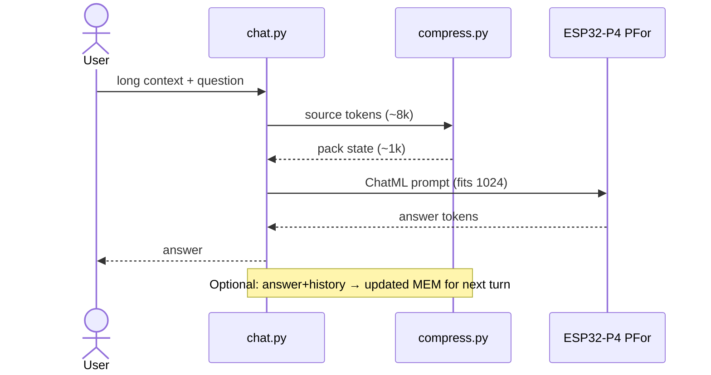

# Goal 1: Context compression (effective long context)

This document is the first product/engineering goal for the **nink/p-for-llm** fork.

Upstream PFor exposes a native context window of **1,024 tokens** (KV/RAM limited on ESP32-P4). We are **not** trying to raise native KV to 8K in this goal. We are raising **effective** context via compression.

## Target

| Metric | Goal |
| --- | --- |
| Compression ratio | **~8:1** (source tokens → tokens sent to the model) |
| Native window | Still **1,024** |
| Effective input | ~**8,000** tokens of source material per turn (before reply budget) |
| First implementation | **Host-side** (PC), wrapping the existing USB chat path |
| Later (optional) | On-device distill pass; finetune model on compressed “pack state” dialect |

Example: an ~8k-token document or chat history is reduced to ~1k tokens of dense state, then passed to `P4Device.text()` as today.

## Architecture

Effective long context = **compress outside the model**, then run normal PFor inference inside the native 1,024-token window.



### Trust boundary

| Stage | Where | Role |
| --- | --- | --- |
| Ingest long text | Host | Accept ~8k-token source |
| Compress 8:1 | Host `compress.py` | Lossy but structured packet |
| Generate | P4 PFor | Native 1,024 KV only |
| Roll memory | Host | `MEM` keeps multi-turn effective context |



### Compression sketch (pack state)

```text
SRC  ████████████████████████████████  ~8000 tokens
         │  8:1 compress
         ▼
PKT  ████                              ~1000 tokens  →  PFor (1024 window)
         + question + reply budget
```

## What success looks like

1. User (or tool) provides long text + a question.
2. Fork compresses to a short packet (schema and/or extractive summary).
3. Board generates an answer using only that packet + question.
4. Measured ratio ≈ 8:1 on a fixed eval set, with acceptable factual retention (numbers, names, negations preserved).

Multi-turn: compress running history into a rolling `MEM` blob so sessions stay long without growing the native window.

## Non-goals (for this milestone)

- Expanding on-chip KV cache to true 8K context
- Domain apps (vehicle diagnostics, appliances, education packs)
- Replacing upstream training/runtime architecture

## Planned code touchpoints

- `runtime/host/compress.py` — compression API (8:1 target)
- `runtime/host/chat.py` — optional `--compress` path before `device.text(...)`
- Eval fixtures under `docs/` or `runtime/host/testdata/` — ratio + quality checks

## Status

**Planned.** Hardware bring-up (stock PFor on ESP32-P4) comes first; then host-side compression on this fork.
