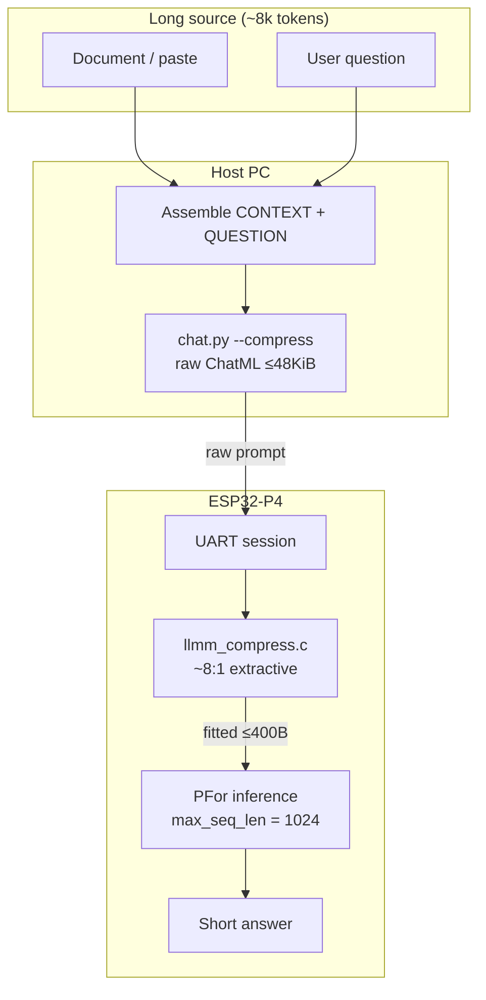
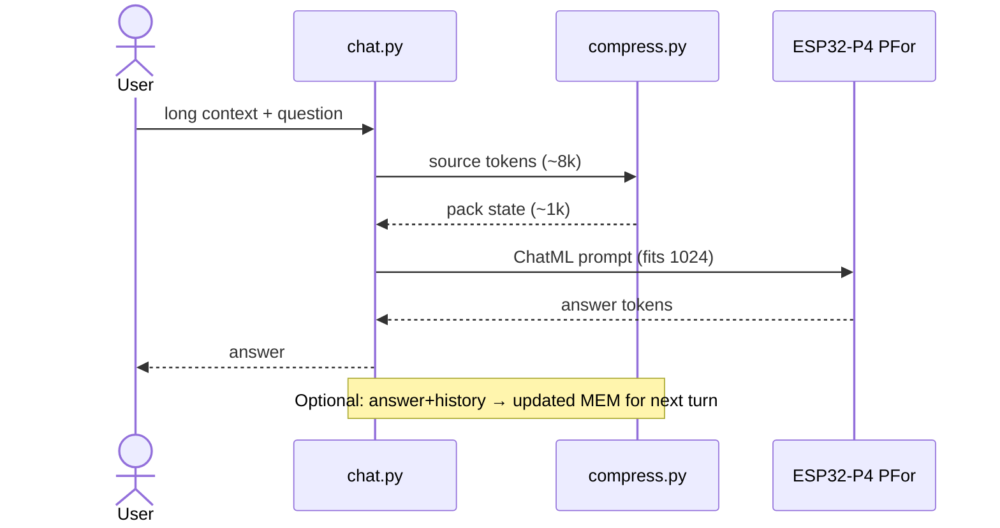

# Goal 1: Context compression (effective long context)

This document is the first product/engineering goal for the **nink/p-for-llm** fork.

Upstream PFor exposes a native context window of **1,024 tokens** (KV/RAM limited on ESP32-P4). We are **not** trying to raise native KV to 8K in this goal. We are raising **effective** context via compression.

## Approach: achieve, then optimize

Ship a **simple working path** first. Do not start with LLMLingua-class token classifiers, on-device distillers, or finetuning.

| Phase | Goal | Done when |
| --- | --- | --- |
| **0 — Bring-up** | Stock PFor chat on ESP32-P4 via this fork | `chat.py` answers short prompts on hardware |
| **1 — Achievable MVP** | **On-device** extractive / budget trim to ~8:1 into the 1,024 window | Host sends raw long paste; board compresses; ratio logged |
| **2 — Optimize** | Better retention (query-aware keep, schema pack, optional LLMLingua-style / small compressor) | Higher eval score at same ~8:1 (or stable quality at higher ratio) |

**Phase 1 method (intentionally boring):** keep question + headings + sentences with numbers/names; drop filler until under budget. Runs on the **ESP32-P4** (`llmm_compress.c`). Host `compress.py` remains for offline ratio checks only.

**Phase 2+:** only after Phase 1 is measurable — smarter compression, rolling `MEM`, finetune on pack-state dialect.

## Target

| Metric | Goal |
| --- | --- |
| Compression ratio | **~8:1** (source tokens → tokens sent to the model) |
| Native window | Still **1,024** |
| Effective input | ~**8,000** tokens of source material per turn (before reply budget) |
| Wire | Host sends raw prompt up to **48 KiB**; board fits long prompts to **≤400 B** (prefill-speed cap) |
| Bypass | Raw prompt **≤1024 B** is not compressed |
| Implementation | On-device `llmm_compress.c` (host `compress.py` = offline only) |

Example: an ~8k-token document or chat history is reduced on the P4 to ~1k tokens of dense state, then run through normal PFor inference.

## Architecture

Effective long context = **compress on the board**, then run normal PFor inference inside the native 1,024-token window.



### Trust boundary

| Stage | Where | Role |
| --- | --- | --- |
| Ingest long text | Host | Accept ~8k-token source |
| Compress | P4 `llmm_compress.c` | Lossy extractive packet (≤400 B fitted) |
| Generate | P4 PFor | Native 1,024 KV only |
| Roll memory | Host | `MEM` keeps multi-turn effective context |



### Compression sketch (pack state)

```text
SRC  ████████████████████████████████  ~8000 tokens
         │  8:1 compress
         ▼
PKT  ████                              ~1000 tokens  →  PFor (1024 window)
         + question + reply budget
```

## What success looks like

### Phase 1 (ship this)

1. User provides long text (~8k tokens) + a question on the host.
2. Fork trims/extracts to a packet that fits the native window with reply budget.
3. Board answers using only that packet + question.
4. Logs show compression ratio near **8:1** (exact quality secondary to “it works”).

### Phase 2 (optimize later)

- Query-aware retention (keep what the question needs)
- Structured pack state / rolling `MEM` for multi-turn
- Optional stronger compressors; measure quality on a fixed eval set

## Non-goals (for Phase 1)

- Expanding on-chip KV cache to true 8K context
- Domain apps (vehicle diagnostics, appliances, education packs)
- Replacing upstream training/runtime architecture
- Best-in-class compression research

## Planned code touchpoints

- `runtime/host/compress.py` — Phase 1: budgeted extractive compress API
- `runtime/host/chat.py` — optional `--compress` path before `device.text(...)`
- Simple ratio logging; eval fixtures when optimizing (Phase 2)

## Status

**Phase 1 on-device compress landed.**

- Host sends raw ChatML up to **48 KiB**; board `llmm_compress.c` fits long prompts to **≤400 B** (≤~80 tok) to cut prefill time. Raw **≤1024 B** bypasses compress.
- `chat.py --compress --context-file …` = **on-device** path (no PC trim).
- `compress.py` remains for **offline** ratio checks only.
- Verified: ~8k-token source → **~100** fitted prompt tokens; long TTFT ~**7.6 s** on COM5 (decode ~8 tok/s).

### Windows ports (important)

This board has one usable USB-UART. Stock upstream firmware talks host protocol on Espressif USB-Serial-JTAG (often COM3); this fork moves host protocol onto **UART0 / CH343**, the same port used to flash.

| Port | Chip | Role |
| --- | --- | --- |
| USB-Enhanced-SERIAL CH343 (**COM5**) | USB-UART bridge | **Flash + `chat.py` / `smoke_test.py`** |
| USB Serial Device (Espressif, often COM3) | USB-Serial-JTAG | Unused on this single-USB board |

If chat times out with no `LLMRDY05`, rebuild/flash the UART-host firmware (`LLMM_HOST_UART=1`) and use COM5 — do not switch to COM3.

### Phase 1 commands

```bash
# Offline compression check (no board) — host reference only
python runtime/host/compress.py \
  --source runtime/host/testdata/sample_long_context.md \
  --question "Why do plant cells need chloroplasts?"

# On-device compress (PC sends raw long prompt)
python runtime/host/chat.py --port COM5 \
  --artifact pfor-180m.llmcraft \
  --compress \
  --context-file runtime/host/testdata/sample_long_context.md
```

