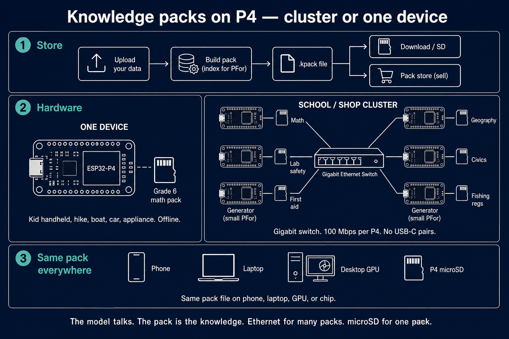
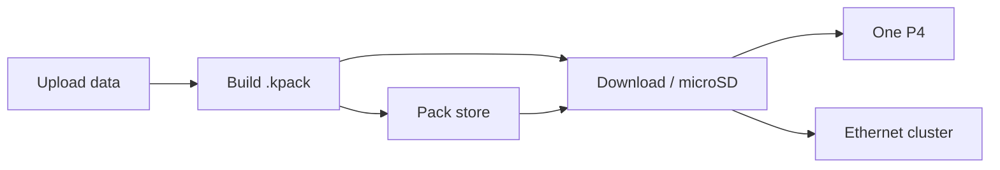
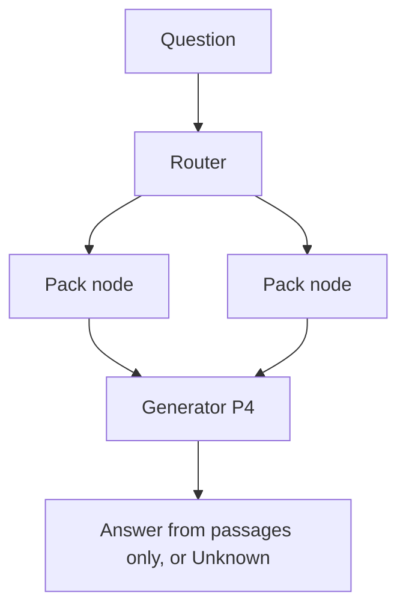

# Knowledge packs (parked 2026-08-15)

Snapshot of the pack + P4 cluster idea before a rethink. Keyword gazetteer lookup on a 180M continuation model is **not** an AI demo. The file format and Ethernet retrieve path still work.

Cursor canvases (source): [p4-knowledge-pack-cluster](canvases/p4-knowledge-pack-cluster.canvas.tsx) · [base-model-knowledge-packs](canvases/base-model-knowledge-packs.canvas.tsx)

## Rule

The model talks. The pack is the knowledge. A miss is **Unknown**, not a guess. Same `.kpack` on phone, laptop, GPU, or a P4 microSD.

## Store → file → device

## Cluster wiring

Gigabit switch, 100 Mbps per P4-ETH. Not USB-C pairs (Type-C on this SKU is CH343 UART).

Examples (not licensed worlds): school math/geography, wilderness forage, fishing regs, appliance error codes, vehicle manuals.

## What shipped on Mercury

- `canada.kpack` (KPK1) on microSD, uploaded over Ethernet (`LLMPUT05`)
- Retrieve RPC `LLMPAK05` — no neural net
- PSRAM hash index after first query (~12 s warm, then tens of ms)
- Host: `python canada-pack/pack_query.py --host 192.168.72.77`

Canada pack builders and eval: [`canada-pack/`](../canada-pack/README.md). 24L FineWeb continue-train on the 170HX box was **stopped**.
